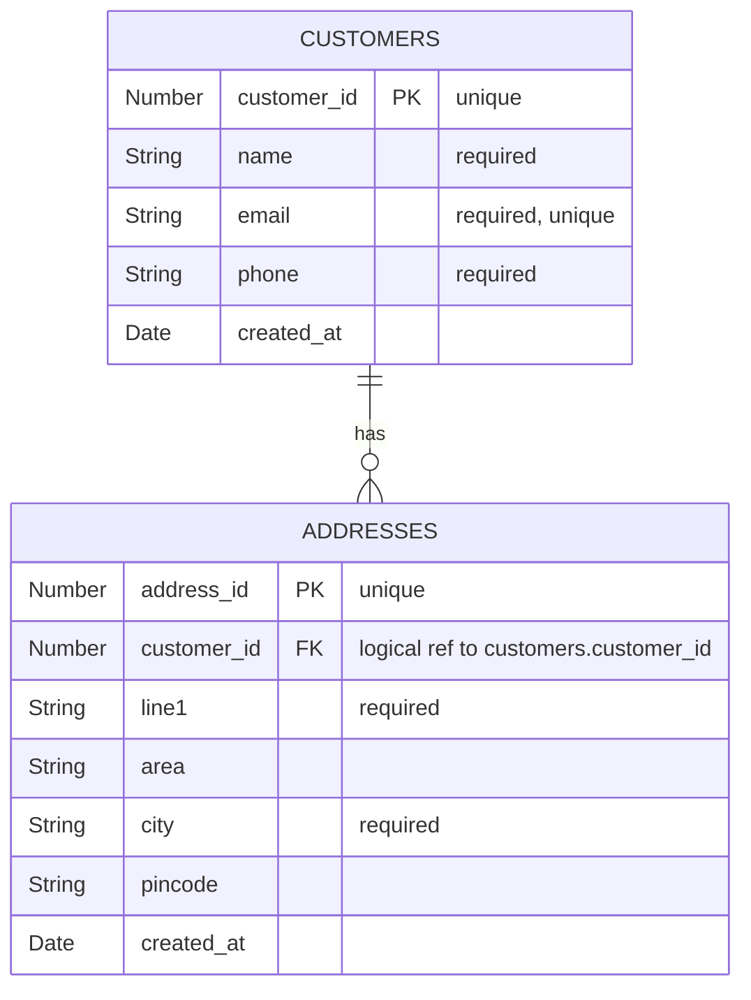

# Customer Service — ER Diagram

**Database:** `customer_db` (MongoDB)
**Collections:** `customers`, `addresses`

## Keys & constraints

| Collection | PK | Unique | Required | Notes |
|---|---|---|---|---|
| `customers` | `customer_id` | `customer_id`, `email` | `customer_id`, `name`, `email`, `phone` | `_id` (ObjectId) also exists — we key by `customer_id` for cross-service use |
| `addresses` | `address_id` | `address_id` | `address_id`, `customer_id`, `line1`, `city` | `customer_id` is an in-service logical reference (no Mongo-level FK) |

## Integrity

- **In-service:** `addresses.customer_id` must point to an existing customer (enforced in `address.service.js` before insert/update).
- **Cascade:** None — addresses are retained if a customer is deleted (service currently doesn't support delete; safe default).
- **Uniqueness:** `email` is enforced by a Mongo unique index on the customers collection.

## Cross-service references (owned elsewhere)

None — customer-service is a pure source-of-truth service.

## Published facts (consumed by others)

- `customer_id`, `email`, `name` → consumed by order-service at order-create time.
- `address_id`, `city` → `address.city` is projected onto orders as `address_city` (replicated read model).
